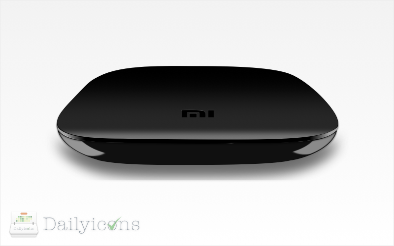

# Dailyicons
one icon one day made by Sketch3.

---
dailyicons is a project to collect every icon I've made in Sketch3. This project contains every icon's source file, output file. all icons under MIT license, easy to reuse or redesign for your own purpose.

## Icons

All icons list below are located in `./icons` folder.

### Dailyicons Blueprint for Sketch 3

a Skecth 3 blueprint is available as `./Dailyicons Blueprint.sketch`, forks and pull requests are welcomed.

#### Day 11: Maker.vc (05/17/2014)

#### Day 10: SPM (05/14/2014)

#### Day 9: douban.fm (05/13/2014)

#### Day 8: handfan (05/07/2014)

#### Day 7: Yuehu Logo (05/06/2014)

This logo is designed for [阅乎](http://yuehu.io).

#### Day 6: a MP3 player (05/05/2014)

It's also a new logo for project [player](https://github.com/turingou/player).

#### Day 5: a pythonic Javascript icon (04/05/2014)

This javascript icon is inspired by Python logo. :)

#### Day 4: Xiaomi Mibox icon (03/05/2014)

This case is a good Bézier curve practice, which contains all four kinds of Path Mode in Sketch3: Straight, Mirrored, Disconnected and Asymmetric. by the way, It's also the logo of one of my projects [Xiaomi](https://github.com/turingou/xiaomi).

#### Day 3: Dailyicons Logo (02/05/2014)

Dailyicons needs a logo, so I made one last night :) This icon shows below is inspired by GitHub contributions grahic and calendar.

#### Day 2: Teabowl (01/05/2014)

Teabowl is a cute japanese teacup icon. It was the very first time I'm using Blur functions in Sketch 3. [Teabowl](https://github.com/turingou/teabowl) is also one of my open source projects.

#### Day 1: Flyer.im (30/04/2014)

Flyer.im is one of my project to manage FFP's points and miles, It's also a social network connecting flyers all together to plan trip and hoilday in groups online. this was the very first version of flyer.im, and also my second icon made by Sketch3.

### Contributing
- Fork this repo and clone it.
- make sure your very own icon to be added.
- Open a pull request, and enjoy <3

### MIT license
Copyright (c) 2014 turing &lt;o.u.turing@gmail.com&gt;

Permission is hereby granted, free of charge, to any person obtaining a copy
of this software and associated documentation files (the &quot;Software&quot;), to deal
in the Software without restriction, including without limitation the rights
to use, copy, modify, merge, publish, distribute, sublicense, and/or sell
copies of the Software, and to permit persons to whom the Software is
furnished to do so, subject to the following conditions:

The above copyright notice and this permission notice shall be included in
all copies or substantial portions of the Software.

THE SOFTWARE IS PROVIDED &quot;AS IS&quot;, WITHOUT WARRANTY OF ANY KIND, EXPRESS OR
IMPLIED, INCLUDING BUT NOT LIMITED TO THE WARRANTIES OF MERCHANTABILITY,
FITNESS FOR A PARTICULAR PURPOSE AND NONINFRINGEMENT. IN NO EVENT SHALL THE
AUTHORS OR COPYRIGHT HOLDERS BE LIABLE FOR ANY CLAIM, DAMAGES OR OTHER
LIABILITY, WHETHER IN AN ACTION OF CONTRACT, TORT OR OTHERWISE, ARISING FROM,
OUT OF OR IN CONNECTION WITH THE SOFTWARE OR THE USE OR OTHER DEALINGS IN
THE SOFTWARE.

---

built upon love by [docor](https://github.com/turingou/docor.git) v0.1.3